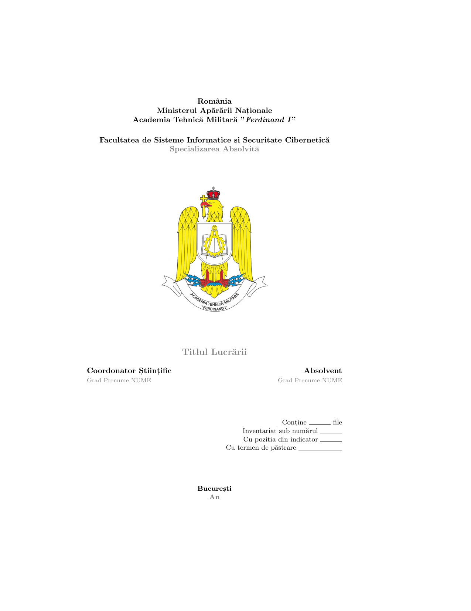
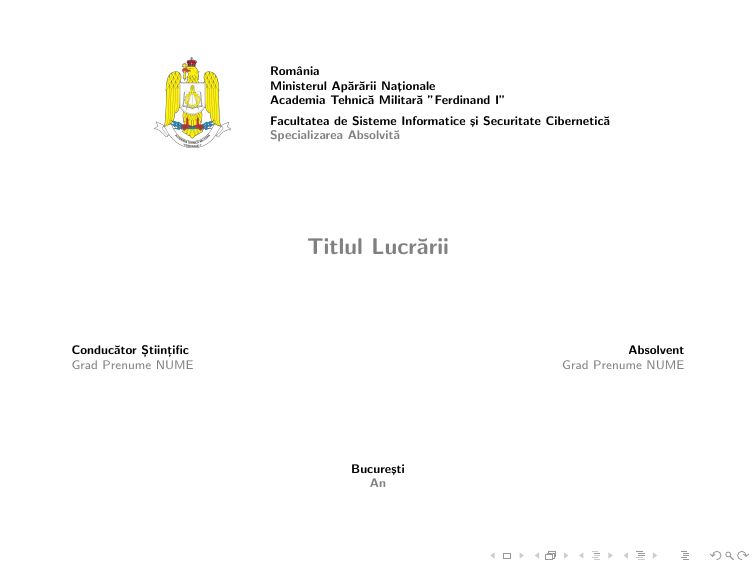

# Șabloane pentru Lucrarea de Diplomă 📕

<details>
<summary><b>Tabel de Conținut</b></summary>

- [Descriere 🖼️](#descriere-️)
- [Vizualizarea Documentelor Rezultate 👀](#vizualizarea-documentelor-rezultate-)
- [Elemente Componente ale Șabloanelor 🧩](#elemente-componente-ale-șabloanelor-)
- [Mod de Lucru 🤸‍♀️](#mod-de-lucru-️)
  - [Pași Inițiali](#pași-inițiali)
  - [Pași Specifici Lucrării Scrise](#pași-specifici-lucrării-scrise)
  - [Pași Specifici Prezentării](#pași-specifici-prezentării)
  - [Pași în Cazul Publicării pe GitHub](#pași-în-cazul-publicării-pe-github)
- [Alte Recomandări 👴🏻](#alte-recomandări-)
- [Resurse 🔗](#resurse-)

***Observație***: Dacă folosiți versiunea web a GitHub, tabelul de conținut este accesibil și în colțul din sus-stânga a secțiunii în care este afișat acest document.

</details>

## Descriere 🖼️

Acest proiect conține **două șabloane LaTeX** (unul pentru partea scrisă, unul pentru prezentare) destinate **proiectelor de diplomă realizate în cadrul Facultății de Sisteme Informatice și Securitate Cibernetică** a Academiei Tehnice Militare "Ferdinand I" București.

Scopul principal este de a propune o **infrastructură** peste care să fie construite efectiv documentele menționate mai sus, și nu de a învăța LaTeX sau modul în care o lucrare de acest tip trebuie redactată. Pentru ultimul aspect, există resurse calitative pe Internet, ce sunt menționate în secțiunea de [resurse](#resurse-).

## Vizualizarea Documentelor Rezultate 👀

| Lucrare Scrisă                                                                                                             | Prezentare                                                                                                                               |
|----------------------------------------------------------------------------------------------------------------------------|------------------------------------------------------------------------------------------------------------------------------------------|
| <a href="thesis/thesis.pdf"><kbd></kbd></a> | <a href="presentation/presentation.pdf"><kbd></kbd></a> |


## Elemente Componente ale Șabloanelor 🧩

Pe lângă elementele obligatorii ale documentelor necesare susținerii proiectului de diplomă, sunt definite în cadrul surselor LaTeX constructe de cod utile redactării conținutului (de exemplu, evidențieri ale textului, imagini și tabele).

Elementele pot fi găsite în fișierul `thesis/components/chapters/components.tex`, unde fiecare este reprezentat de o explicație cu privire la utilizare și de codul sursă. În același timp, o parte din elementele prezentate în lucrarea scrisă sunt prezente și în prezentare, mai exact în fișierul `presentation/components/sections/section.tex`.

De menționat este faptul că în ambele documente, informațiile colorate în gri trebuiesc modificate sau șterse, întrucât ele sunt doar pentru a oferi explicații sau pentru a exemplifica un anumit aspect. În schimb, cuprinsul, tabela de imagini și bibliografia se actualizează automat o dată cu modificarea conținutului lucrării și a surselor bibliografice. În plus, capitolul și *slide*-urile cu componente trebuiesc șterse înainte de finalizarea documentelor.

## Mod de Lucru 🤸‍♀️

Pașii urmați în folosirea acestor șabloane sunt enumerați mai jos. Unii dintre ei sunt separați, fiind folosiți numai în anumite situații.

### Pași Inițiali

1. Descărcarea *repository*-ului de pe GitHub, sub forma unei arhive ZIP
2. Importarea în Overleaf a arhivei ZIP, apăsând opțiunea "*Upload Project*" a meniului deschis în urma apăsării butonului "*New Project*"
3. Setarea detaliilor personale în fișierele numite `configuration.tex`, cu ajutorul *macro*-urilor specifice
    - Titlul lucrării, așa cum apare în detaliere: `\setdetailtitle`
    - Gradul (militar și universitar) și numele complet pentru coordonatorul științific: `\setdetailadviser`
    - Gradul militar și numele complet pentru student: `\setdetailauthor`
    - Anul finalizării lucrării: `\setdetaildate`
    - Specializarea absolvită: `\setdetailspecialization`

### Pași Specifici Lucrării Scrise

Pașii de mai jos sunt independenți unul de altul, fiind folosiți la nevoie.

- Crearea de capitole noi
   1. Crearea unui fișier nou, cu extensia `.tex`, in *folder*-ul `thesis/components/chapters`
   2. Adăugarea în fișierul `thesis/components/chapters/all.tex` a unui *macro* de tip `\subfile{CHAPTER}`, unde `CHAPTER` este numele fișierului creat la pasul anterior, fără extensie
- Adăugarea de surse bibliografice
    1. Folosirea unui *website* menționat în secțiunea de [resurse](#resurse-) pentru obținerea unei citări BibTeX
    2. Folosirea proprietății `options       = {skipbib=true}` pentru sursele citate o singură dată, ce nu trebuie să apară în bibliografie (și numai într-o notă de subsol, de exemplu)
    3. În cazul în care ordinea de afișare a surselor din bibliografie nu este corectă, folosirea *macro*-ului `\noopsort{N}`, unde `N` indică poziția din bibliografie
- Adăugarea de abrevieri prin adăugarea în fișierul `thesis/components/frontmatter/abbreviations.tex` a unui *macro* de tip `\item[X] Y`, unde `X` este abrevierea și `Y` expresia necomasată
- Ascunderea detaliilor necesare inventarierii lucrării, prin comentarea liniei ce conține `\showinventary`, din fișierul `thesis/configuration.tex`
- Ascunderea rezumatului coordonatorului științific, prin comentarea liniei ce conține `\showadviserresume`, din fișierul `thesis/configuration.tex`
- Ascunderea detalierii, prin comentarea liniei ce conține `\showspecification`, din fișierul `thesis/configuration.tex`
- Dezactivarea îngroșării textului, prin decomentarea liniei ce conține `% \disablebold`, din fișierul `thesis/configuration.tex`
- Finalizarea documentului prin completarea unor detalii
    - Mulțumiri, în fișierul `thesis/components/frontmatter/acknowledgment.tex`
    - Rezumatul coordonatorului științific, în fișierul `thesis/components/frontmatter/adviser_resume.tex`
    - Detalierea lucrării, în fișierul `thesis/components/frontmatter/specification.tex`
    - Rezumatul lucrării, în fișierul `thesis/components/frontmatter/abstract.tex`

### Pași Specifici Prezentării

Pașii de mai jos sunt independenți unul de altul, fiind folosiți la nevoie.

- Crearea unei secțiuni (ce este o grupare de *slide*-uri) noi
    1. Crearea unui fișier nou, cu extensia `.tex`, in *folder*-ul `presentation/components/sections`
    2. Adăugarea în fișierul `presentation/main.tex` a unui *macro* de tip `\include{components/sections/SECTION}`, unde `SECTION` este numele fișierului creat la pasul anterior, fără extensie
- Introducerea unei pauze înainte de afișarea unui element, prin folosirea *macro*-ului `\pause` înaintea elementului vizat
- Ascunderea unor porțiuni (de exemplu, care sunt eliminate pentru o mai bună încadrare în timp ca urmare a importanței lor scăzute) prin înconjurarea lor în *macro*-ul `\extras`
- Afișarea tuturor porțiunilor ascunse (de la pasul descris mai sus), prin decomentarea liniei ce conține `% \showextrastrue`, din fișierul `presentation/configuration.tex`

### Pași în Cazul Publicării pe GitHub

1. Crearea unui *repository* nou (eventual prin crearea unui *fork* a *repository*-ului acestuia)
2. Descărcarea surselor și a documentului PDF rezultat, din Overleaf
3. Popularea fișierului `README.md` cu detalii relevante despre lucrarea redactată
4. Actualizarea imaginilor de previzualizare prin rularea comenzilor de mai jos (*numai în cazul păstrării tabelului de previzualizare din `README.md`*)

    ```
    sudo apt-get install poppler-utils
    pdftoppm presentation/presentation.pdf presentation/preview -png -f 1 -singlefile
    pdftoppm thesis/thesis.pdf thesis/preview -png -f 1 -singlefile
    ```

## Alte Recomandări 👴🏻

1. Dacă doriți să folosiți aceste șabloane, dar fără a învăța sintaxa LaTeX, puteți utiliza totuși Markdown pentru a scrie conținutul lucrării. Ulterior, fișierele Markdown se pot transforma în reprezentarea lor în LaTeX cu ajutorul unor instrumente precum *script*-urile menționate în secțiunea de [resurse](#resurse-). Acolo este menționat unul și pentru conversia din CSV în LaTeX, pentru a ușura crearea de tabele.
2. Formulele matematice pot fi create atât manual (cu ajutorul sintaxei specifice), cât și cu ajutorul unor editoare (vezi secțiunea de [resurse](#resurse-)). În plus, unele formule pot fi direct preluate de pe *website*-uri precum Wikipedia, din atributul `alt` al *tag*-ului `` specific unei formule afișate.
3. O exemplificare a rezultatului ce se poate obține în urma utilizării acestor șabloane poate fi găsită într-un alt *repository* personal, ce conține lucrarea mea de diplomă. Acesta este referențiat în secțiunea următoare.

## Resurse 🔗

| Nume                                                                          | Tip           | Scop                                                                  |
|-------------------------------------------------------------------------------|---------------|-----------------------------------------------------------------------|
| [Overleaf](https://www.overleaf.com/project)                                  | platformă web | Redactarea *online* de documente LaTex                                | 
| [dexonline](https://dexonline.ro/)                                            | platformă web | Definirea cuvintelor limbii române                                    |
| [Reverso Translate](https://www.reverso.net/text_translation.aspx)            | platformă web | Traducerea contextuală                                                |
| [LanguageTool](https://languagetool.org/)                                     | platformă web | Verificarea gramaticală a textului                                    |
| [Google Schoolar](https://scholar.google.com/)                                | platformă web | Căutarea de surse bibliografice și citare BibTeX                      |
| [bibme](https://www.bibme.org/bibtex)                                         | platformă web | Citare BibTeX și generator                                            |
| [LucidChart](https://www.lucidchart.com/)                                     | platformă web | Crearea de diagrame                                                   |
| [StarUML](https://staruml.io/)                                                | program       | Crearea de diagrame UML                                               |
| [Lagrida's LaTeX Equation Editor](https://latexeditor.lagrida.com/)           | platformă web | Crearea facilă de ecuații LaTeX                                       |
| [`md_to_latex`](https://github.com/iosifache/scripts/tree/main/md_to_latex)   | *script*      | Conversia Markdown în LaTeX                                           |
| [`csv_to_latex`](https://github.com/iosifache/scripts/tree/main/csv_to_latex) | *script*      | Conversia CSV în LaTeX                                                |
| [Proiectul de diplomă](http://swarm.cs.pub.ro/~razvan/wiki/school/diploma)    | articol       | Recomandarea unor bune practici cu privire la redactarea documentelor |
| [BachelorThesis](https://github.com/iosifache/BachelorThesis)                 | *repository*  | Exemplificarea folosirii acestor șabloane                             |